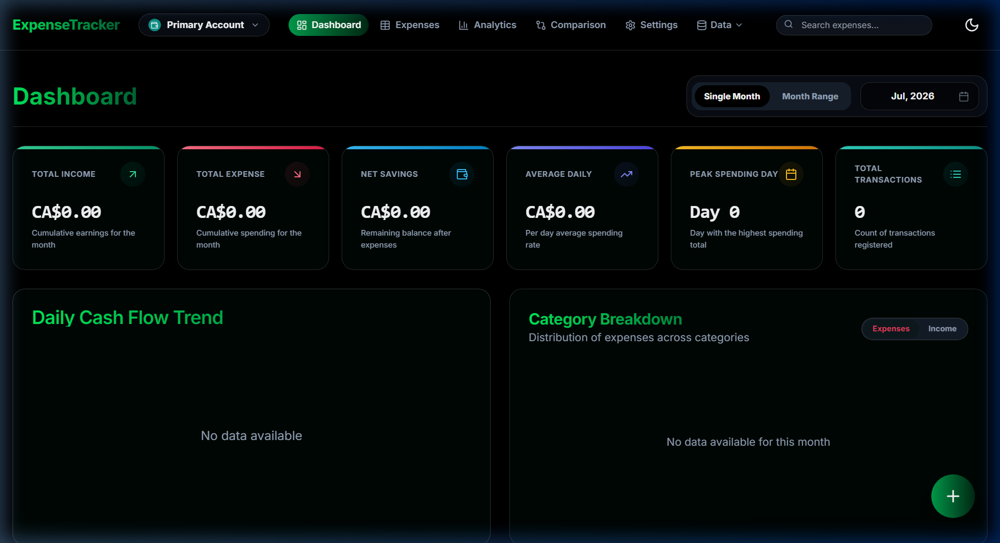
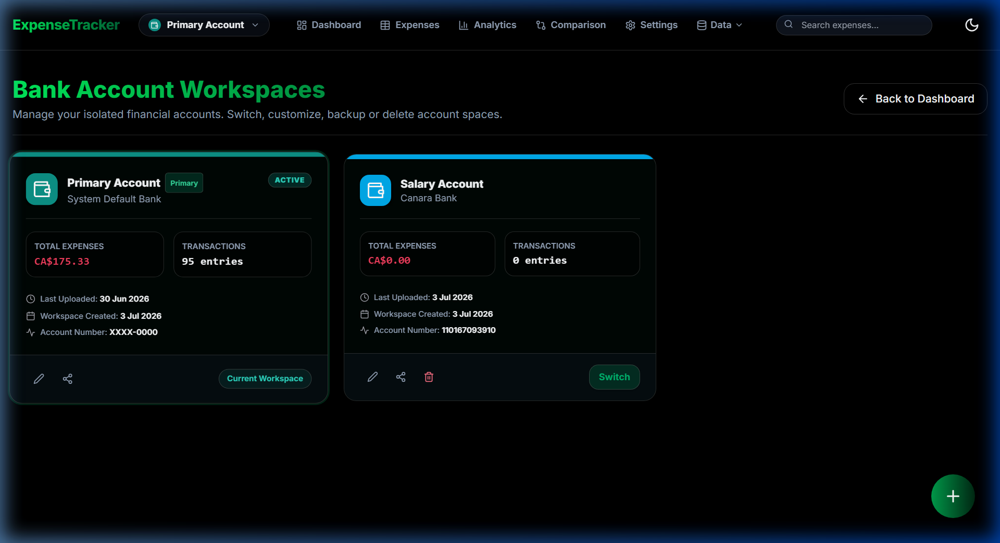
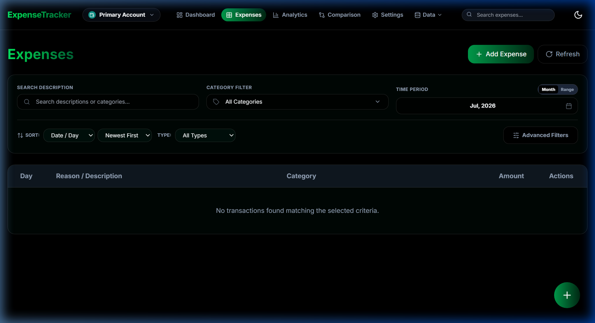
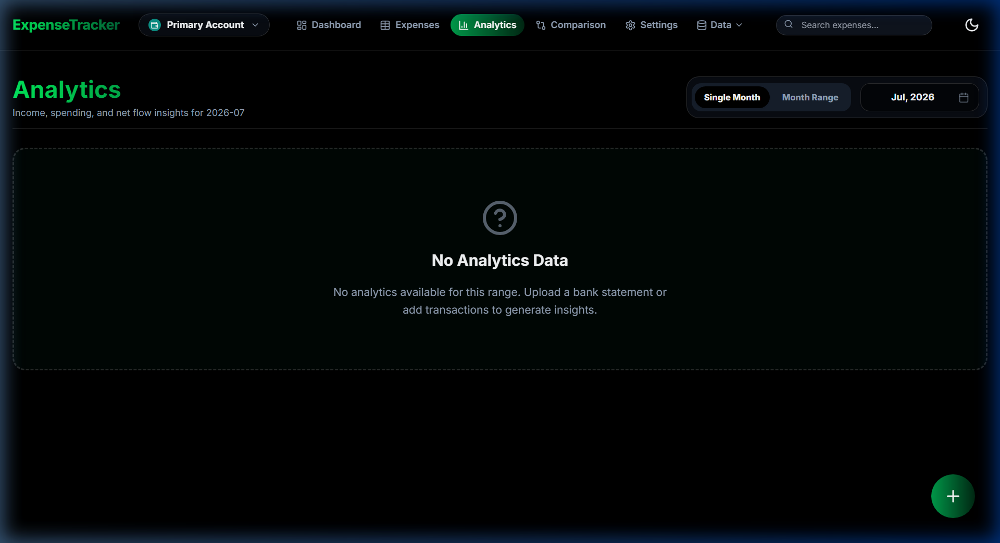
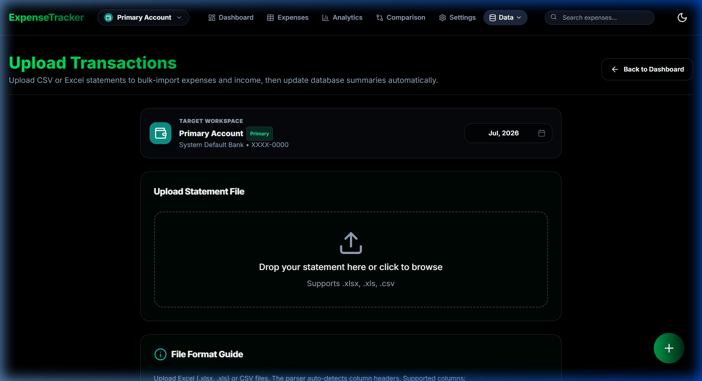
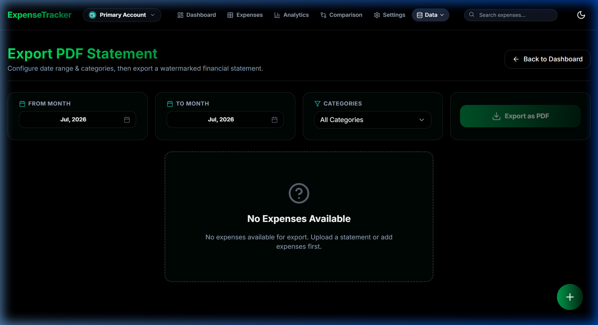

# Expense Analytics Dashboard

<div align="center">

A **premium, full-stack expense tracking and analytics platform** with a dark-glassmorphic UI, interactive charts, real-time filtering, intelligent category auto-detection, customizable themes, and secure CRUD operations.

<br/>

[](https://nextjs.org/)
[](https://react.dev/)
[](https://www.typescriptlang.org/)
[](https://tailwindcss.com/)
[](https://nodejs.org/)
[](https://expressjs.com/)
[](https://www.mongodb.com/)
[](https://www.docker.com/)

</div>

---

## Screenshots

### Dashboard


### Workspace Accounts


### Expenses


### Analytics


### Upload


### Export


---

## Key Features

### Isolated Workspaces & Bank Accounts
- **Bank Account Collection Workspace** – Added an isolated workspace mechanism where each bank account functions as an entirely independent dataset (Dashboard, Expenses, Uploads, Analytics, Export, Categories, Monthly Summaries, Reports, Predictions, Heatmaps, Statistics, and Uploaded Statements).
- **Workspace Customizations** – Customize individual bank workspace color theme accents, icon styles, masked account numbers, and primary identifiers.
- **Secure Deletions** – Workspace configuration settings and transaction deletions are secured via SHA-256 password hash validations.
- **Mobile Responsive Drawer Switching** – Compact listing view for workspaces on mobile screens, and inline SVG icon switcher toggles.

### Custom Month Picker UI
- **Zero-Browser Dropdown Dependences** – Replaced native HTML month calendars with a custom React MonthPicker component featuring year select, 12-month selection blocks, and action options.
- **Dynamic Viewport Alignments** – Uses client-side bounding checks to prevent popover display overflows on screen edges.
- **Month Range Queries** – Fully integrated start-to-end month query capabilities (`startMonth:endMonth`) on Dashboard, Analytics, and Expenses.

### Dashboard
- **Monthly Heatmap Calendar** – Day-aligned calendar grid showing spending intensity via color-scaled blocks. Hover for detailed tooltips; click any day to view all transactions for that date.
- **Category Breakdown Donut Chart** – [Recharts](https://recharts.org/) SVG donut with centered totals and slim-scroll custom legends.
- **KPI Cards** – Real-time cards tracking Monthly Total, Daily Average, Peak Spending Day, and transaction count.

### Analytics
- **Interactive Spending Predictor & Fixed Costs Planner** – Dynamic projection tool to simulate and budget total monthly spending:
  - **Remaining Variable Spend**: Configure an expected daily spend rate for remaining calendar days.
  - **Fixed Costs**: Set amounts for recurring items (e.g., Rent, Bills) and toggle projection. The tool automatically detects if Rent or Bills categories are already paid in actual logs, preventing double-counting by syncing inputs with paid values.
  - **Visualizer Bar**: Multi-colored progress bar mapping actual spent, projected variable, projected fixed, and a budget target overlay.
  - **Status Alerts**: Automatic notifications calculating whether you are projected to finish the month under or over budget.
- **Weekly Spending Bars** – Cumulative weekly totals rendered as gradient bar charts.
- **Weekday vs. Weekend Dynamics** – Side-by-side breakdowns of transaction count, total spend, and average transaction value.
- **Transaction Size Distribution** – Progress-meter groupings: Micro/Small (< ₹250), Medium (₹250–₹1000), Large (> ₹1000).
- **Automated Smart Insights** – Auto-detected spending spikes, top category totals, frequency counts, and month-half volume trend indicators.

### Expenses
- **Filterable & Sortable Table** – Filter by category, month, and full-text search. Multi-key sort (Date/Day, Amount, Description) with explicit order labels (Newest First / Oldest First, Highest First / Lowest First, A–Z / Z–A).
- **Quick View Insights Bar** – Live stat cards (Visible Spend Total, Visible Average, Top Category, Top Single Expense) that update with the current page view.
- **Expense Detail Page** – Full-screen expense card with similar expense list grouped by date.
- **Add / Edit / Delete** – Full CRUD with dialogs rendered at the page root (outside any CSS containing-block context), password-protected deletion with SHA-256 verification.
- **Global Floating Action Button (FAB)** – Rendered in the root layout, available on both mobile and desktop, bypasses any `backdrop-filter` containing-block issues.

### Settings & Customization
- **Appearance Customizer** – Fully customize the styling palette (Background, Card, Foreground, Borders, Primary accent, Button and Text gradient start/end coordinates) for both Light and Dark themes. Supports multiple predefined themes (e.g., *Teal Harmony*, *Royal Amethyst*, *Sunset Glow*, *Ocean Calm*, *Sakura Blossom*, *Cyberpunk Neon*, *Charcoal Elegance*, *Nordic Frost*, *Honeycomb Gold*).
- **Currency Configurator** – Toggle preferred currencies (USD, INR, EUR, etc.) with dynamic translation and formatting hooks applying changes globally across the UI.
- **Data Management Controls** – Standard drag-and-drop CSV/Excel importing alongside a secure database reset utility protecting your database from unauthorized wipes with SHA-256 validation.
- **Category Manager** – Add custom categories, modify hex color associations, assign parsing keywords for file imports, or delete custom categories. Includes a simple restore-to-defaults feature.

### Upload
- **Drag-and-Drop Dropzone** – Accepts CSV and Excel (.xlsx, .xls) files.
- **Auto-Category Detection** – Server-side rule engine classifies transactions by keyword matching (Breakfast, Lunch, Dinner, Groceries, Transport, Shopping, Drinks, Others) which can be updated dynamically via user settings.
- **PDF Preview** – Mobile-friendly embedded PDF viewer for uploaded statements.

### Export
- Downloadable expense reports as filtered PDF exports with statement period and category filters.

### Design System
- **Dark Mode Glassmorphism** – Pitch-black (`#000000`) background with semi-transparent navy card backdrops and soft border glows.
- **Light Mode** – Soft pastel teal backdrop (`hsl(168, 63%, 97%)`).
- **Premium Typography** – [Google Fonts Inter](https://fonts.google.com/specimen/Inter) with consistent heading hierarchy across all pages.
- **Micro-animations** – Page-level fade-in, hover scale, and smooth dialog zoom transitions.
- **FAB** – Teal-to-indigo gradient pill button with rotating `+` icon on hover.
- **Dark Mode Selects** – Global CSS override ensures `<select>` / `<option>` elements use solid slate-900 backgrounds in dark mode for legibility across all browsers.

---

## Built With

<div align="center">

| | Technology | Role |
|:---:|:---|:---|
| [](https://nextjs.org/) | **Next.js 14** | Frontend framework with App Router & React Server Components |
| [](https://react.dev/) | **React 18** | UI component model with hooks |
| [](https://www.typescriptlang.org/) | **TypeScript 5** | End-to-end static typing (frontend & backend) |
| [](https://tailwindcss.com/) | **TailwindCSS 3** | Utility-first styling with custom design tokens |
| [](https://nodejs.org/) | **Node.js v18+** | JavaScript runtime for the backend |
| [](https://expressjs.com/) | **Express 4** | REST API server with typed controllers |
| [](https://www.mongodb.com/) | **MongoDB + Mongoose 8** | NoSQL database with typed schema models |
| [](https://www.docker.com/) | **Docker Compose** | Full-stack containerized deployment |
| [](https://recharts.org/) | **Recharts 2** | SVG charts with gradients and custom tooltips |
| [](https://axios-http.com/) | **Axios** | HTTP client for API communication |
| [](https://lucide.dev/) | **Lucide React** | Unified icon library |
| [](https://fonts.google.com/specimen/Inter) | **Inter** | Premium Google Font via `next/font` |
| [](https://github.com/expressjs/multer) | **Multer + xlsx + csv-parser** | File upload and multi-format parsing |

</div>

---

## Directory Structure

```
expense-dashboard/
├── backend/
│   ├── src/
│   │   ├── app.ts                    # Express app entrypoint, CORS, middleware
│   │   ├── controllers/
│   │   │   ├── analyticsController.ts
│   │   │   ├── dashboardController.ts
│   │   │   └── expenseController.ts  # CRUD for expenses, search, pagination
│   │   ├── middleware/
│   │   │   └── auth.ts               # Password hash verification (SHA-256)
│   │   ├── models/
│   │   │   ├── Category.ts           # Schema for custom category configurations
│   │   │   ├── Expense.ts            # Mongoose schema: day, amount, reason, category, month
│   │   │   ├── MonthlySummary.ts
│   │   │   └── Settings.ts           # Schema for user theme settings and configuration
│   │   ├── routes/
│   │   │   ├── analyticsRoutes.ts
│   │   │   ├── categoryRoutes.ts     # CRUD & default overrides for categories
│   │   │   ├── dashboardRoutes.ts
│   │   │   ├── expenseRoutes.ts
│   │   │   └── settingsRoutes.ts     # Save/get custom theme settings
│   │   ├── services/
│   │   │   ├── analyticsService.ts   # Aggregation pipelines, smart insight logic
│   │   │   ├── categoryService.ts     # Predefined / custom category helpers
│   │   │   └── expenseService.ts
│   │   └── utils/
│   │       ├── categoryDetector.ts   # Keyword-based auto-categorization
│   │       ├── csvParser.ts
│   │       ├── dateUtils.ts          # Local timezone-aware month & day calculations
│   │       ├── fileParser.ts         # CSV/Excel parsing logic with clamped date ranges
│   │       └── xlsxParser.ts
│   ├── .env                          # PORT, MONGO_URI
│   ├── package.json
│   └── tsconfig.json
│
├── frontend/
│   ├── app/                          # Next.js App Router pages
│   │   ├── layout.tsx                # Root layout: ThemeCustomizerProvider + Nav + FAB
│   │   ├── globals.css               # Design tokens, scrollbar, dark mode overrides
│   │   ├── page.tsx                  # Redirect → /dashboard
│   │   ├── dashboard/page.tsx        # Heatmap + KPI cards + Donut chart
│   │   ├── expenses/
│   │   │   ├── page.tsx              # Expense table, filters, CRUD dialogs (page-root rendered)
│   │   │   └── [id]/page.tsx         # Expense detail + similar expenses
│   │   ├── analytics/page.tsx        # Weekly bars, weekday/weekend, predictor, insights
│   │   ├── settings/
│   │   │   └── page.tsx              # Control panel: appearance, currency, data, categories
│   │   ├── upload/page.tsx           # File upload dropzone + PDF preview
│   │   └── export/page.tsx           # PDF export with filters
│   │
│   ├── components/
│   │   ├── theme-customizer-provider.tsx # Context for theme settings, hex-to-HSL parser, and category states
│   │   ├── theme-provider.tsx
│   │   ├── navigation.tsx            # Responsive nav bar with dark/light toggle
│   │   ├── desktop-fab.tsx           # Global FAB button + AddExpenseDialog (layout-level)
│   │   ├── charts/
│   │   │   └── monthly-heatmap.tsx   # Calendar-aligned weekday heatmap with tooltips
│   │   ├── analytics/
│   │   │   └── spending-predictor.tsx # Variable & fixed spending projection simulator
│   │   └── expenses/
│   │       ├── expense-table.tsx     # Table with pagination; fires onEdit/onDeleteRequest
│   │       ├── expense-filters.tsx   # Search, category, month, sort filters
│   │       ├── add-expense-dialog.tsx
│   │       └── edit-expense-dialog.tsx
│   │
│   ├── hooks/
│   │   ├── use-currency.tsx          # Currency formatting and conversion helpers
│   │   ├── useExpenses.ts            # Paginated expense fetching + expense-added event listener
│   │   └── useDashboard.ts           # Dashboard summary data fetching
│   │
│   ├── services/api.ts               # Axios instance (NEXT_PUBLIC_API_URL)
│   └── types/                        # Shared TypeScript interfaces
│
├── assets/screenshots/               # App page screenshots
├── Dockerfile.backend
├── Dockerfile.frontend
├── docker-compose.yml                # Orchestrates frontend + backend + MongoDB
└── README.md
```

---

## Architecture Notes

### Timezone-Aware Date Handling (fix/date-issue)
To prevent date display and month boundary mismatches between local client settings and server/UTC times, dates are parsed and queried using dedicated timezone-aware helper routines (`getLocalMonthString` and `getLocalMonth`). This guarantees that user interactions, heatmaps, and summaries always match the client's localized calendar boundaries.

### Clamped Upload Day Parsing
When parsing CSV or Excel templates, uploaded data is strictly clamped between day `1` and `maxDays` of the selected target month. This prevents database indexing anomalies and frontend rendering errors from rows containing invalid calendar days (e.g. Day 32).

### Settings Database Synchronization & Fallbacks
Theme customizer options and custom category configurations are synced with the MongoDB database using `/api/settings` and `/api/categories` endpoints. To avoid style flashes during client hydration, these settings are also mirrored locally in `localStorage`. 

### Dialog Positioning
All modal dialogs (`AddExpenseDialog`, `EditExpenseDialog`, delete confirmation) are rendered **at the page root level** — outside `ExpenseTable`'s `overflow-hidden` card — to avoid CSS containing-block issues from `backdrop-filter`. Dialog panels use `style={{ backdropFilter: 'none' }}` and `z-[200]` to float above all other layers.

### Custom Event Bus
The global FAB dispatches a `window` custom event `expense-added` on success. Both `useExpenses` and `useDashboard` hooks subscribe to this event, enabling cross-component data refresh without prop drilling.

### Search Regex Safety
The backend escapes all special regex characters from the search query before building the MongoDB `$regex` filter, preventing crashes for inputs containing `(`, `)`, `[`, `]`, etc.

### Security
Expense and category deletion requires a administrator verification password via the `x-delete-password` HTTP header. The backend compares the SHA-256 hash of the submitted password against the stored hash before authorizing.

---

## Setup & Local Development

### Prerequisites

[](https://nodejs.org/)
[](https://www.mongodb.com/)

### 1. Backend

```bash
cd backend
npm install
```

Create `backend/.env`:
```env
PORT=5000
MONGO_URI=mongodb://localhost:27017/expense-tracker
# Optional delete password hash (Default corresponds to: admin123)
DELETE_PASSWORD_HASH=af0dce62e992efc95dc1e0985253fd368e54a32c60852cf77cf2c90bc839ecad
```

```bash
npm run dev
```

### 2. Frontend

```bash
cd frontend
npm install
```

Create `frontend/.env`:
```env
NEXT_PUBLIC_API_URL=http://localhost:5000/api
```

```bash
npm run dev
# Open http://localhost:3000
```

---

## Docker Deployment

[](https://www.docker.com/)

Spin up the full stack (Frontend + Backend + MongoDB) with a single command:

```bash
docker-compose up --build
```

| Service | URL |
|:---|:---|
| Frontend | http://localhost:3000 |
| Backend API | http://localhost:5000/api |
| MongoDB | mongodb://localhost:27017 |
